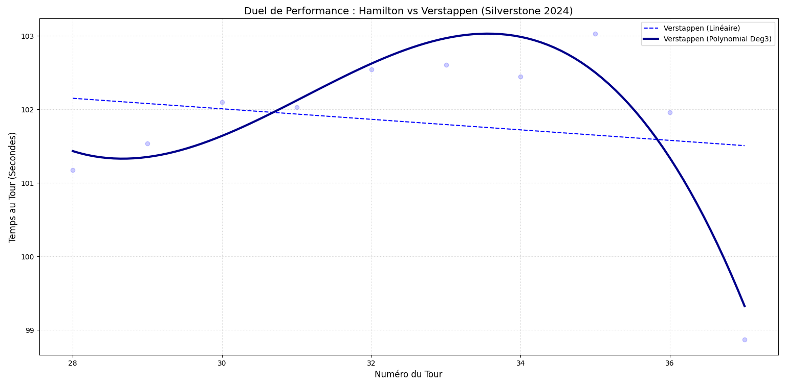

# 🏎️ F1 Tire Performance Analysis - Silverstone 2024

Analyse de la télémétrie FIA pour modéliser la dégradation des pneus de Lewis Hamilton et Max Verstappen.

## 📊 Modélisation IA
Le projet utilise une **Régression Polynomiale (Degré 3)** pour capturer la perte d'adhérence réelle, dépassant la précision d'un modèle linéaire classique.

## 🛠️ Stack Technique
- **Langage** : Python
- **Bibliothèques** : FastF1, Pandas, Matplotlib, Scikit-Learn (Machine Learning)